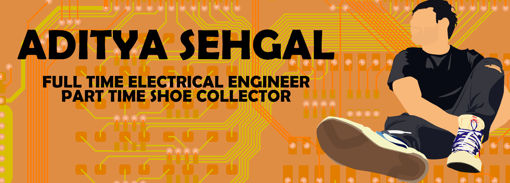

## ***Hi! 👋***

I'm Aditya (Adi) and i'm recent graduate from UCSC with a Bachelors in Electrical Engineering. 
I love working with digital logic and designing PCBs. 
I always try to find new things to do, currently I am learning Python, Flutter and Altium Designer!

### ***Tools and Languages***

> Eagle CAD / KiCad / Cadence Allegro / Vivado / MPLab X / Magic VLSI / Fusion 360   
Verilog / CHISEL / Embedded C / C++ / Python / Java / MIPS Assembly 

####

<!-- ### Hi there 👋 -->

<!--
**adsehgal/adsehgal** is a ✨ _special_ ✨ repository because its `README.md` (this file) appears on your GitHub profile.

Here are some ideas to get you started:

- 🔭 I’m currently working on ...
- 🌱 I’m currently learning ...
- 👯 I’m looking to collaborate on ...
- 🤔 I’m looking for help with ...
- 💬 Ask me about ...
- 📫 How to reach me: ...
- 😄 Pronouns: ...
- ⚡ Fun fact: ...
-->
